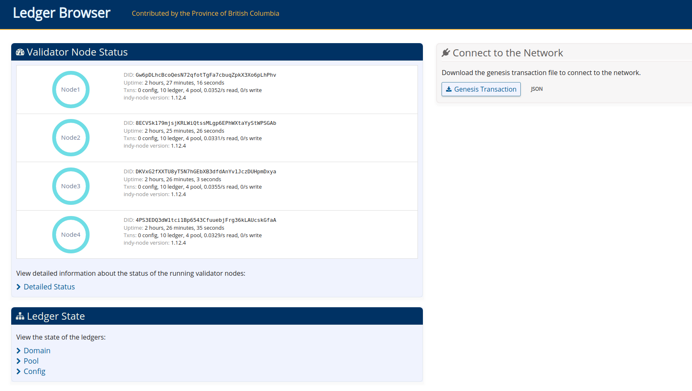

# 1.Instalação Indy Nodes no Ubuntu 18.04

**1.1 instalar o indy**
<pre>
mkdir -p /home/indy
pip3 install python3-indy
pip3 install indy-plenum
pip3 install indy_node
</pre>

**1.2 Instalar o rockesdb**
<pre>
sudo apt-get update
sudo apt-get install apt-transport-https ca-certificates
apt-key adv --keyserver keyserver.ubuntu.com --recv-keys CE7709D068DB5E88
sudo add-apt-repository "deb https://repo.sovrin.org/deb xenial master"

sudo apt-get update
sudo apt-get install libbz2-dev \
    zlib1g-dev \
    liblz4-dev \
    libsnappy-dev \
    rocksdb \
    liblz4-dev

</pre>

**1.3 Incluir o script start_node no /usr/bin**
<pre>
cp /home/indy/scripts/start_node /usr/bin
</pre>

**1.4 Incluir o script von_generate_transactions  no /usr/bin**
<pre>
cp /home/indy/bind/von_generate_transactions /usr/bin
</pre>

**5. Inclusão de arquivos aml.json e taa.json no diretório "/home/indy/config/"**

aml.json
<pre>
{
  "version": "1.0",
  "context": "http://aml-context-descr",
  "aml": {
     "product_eula": "The agreement was included in the software product’s terms and conditions as part of a license to the end user.",
     "service_agreement": "The agreement was included in the terms and conditions the user accepted as part of contracting a service.",
     "at_submission": "The agreement was reviewed by the user and accepted at the time of submission of this transaction.",
     "for_session": "The agreement was reviewed by the user and accepted at some point in the user’s session prior to submission.",
     "wallet_agreement": "The agreement was reviewed by the user and this affirmation was persisted in the user’s wallet for use during submission.",
     "on_file": "An authorized person accepted the agreement, and such acceptance is on file with the user’s organization."
  }
}
</pre>

taa.json
<pre>
{
  "version": "1.1",
  "text": "TAA Goes *Here*\n\n- got it",
  "ratification_ts": 1597654073
}
</pre>

**6. Instalar o lib-crypto**
<pre>
apt-get install libindy_crypto
cp /usr/lib/libindy_crypto.so /usr/local/lib/
</pre>

**7.Incluir o diretório sandbox**
<pre>
mkdir -p /home/indy/ledger/sandbox
</pre>

**8.Incluir o arquivo de configuração /etc/indy/indy_config.py**

<pre>
NETWORK_NAME = 'sandbox'
LEDGER_DIR = '/home/indy/ledger'
LOG_DIR = '/home/indy/log'
KEYS_DIR = LEDGER_DIR
GENESIS_DIR = LEDGER_DIR
BACKUP_DIR = '/home/indy/backup'
PLUGINS_DIR = '/home/indy/plugins'
NODE_INFO_DIR = LEDGER_DIR
CLI_BASE_DIR = '/home/indy/.indy-cli/'
CLI_NETWORK_DIR = '/home/indy/.indy-cli/networks'i
</pre>

**9.Incluir o arquivo de configuração /etc/indy/indy_config.py**

<pre>
NODE_NAME=Nome-do-node
NODE_IP=0.0.0.0
NODE_PORT=porta
NODE_CLIENT_IP=0.0.0.0
NODE_CLIENT_PORT=porta
CLIENT_CONNECTIONS_LIMIT=500
</pre>

**10.Instalar o webservice para a rede**
<pre>
cd /home/indy
git clone https://github.com/bcgov/von-network.git
</pre>

# 2.Iniciar os nodes

**2.1 Iniciarlizar os nodes**

init_indy_keys --name <Nome do Node>

Exemplo :
<pre>
init_indy_keys --name Node1
init_indy_keys --name Node2
init_indy_keys --name Node3
init_indy_keys --name Node4
</pre>
obs.:Cada node usado deve ser inicializado na console de cada instância.

**2.2 Geração do pool de transações**
generate_indy_pool_transactions --nodes <quantidade-de-nodes> --clients 5 --nodeNum <numero do node> --ips 'endereços IP' --network=<nome-da-rede>

Exemplo para criar dois nodes: 
<pre>
generate_indy_pool_transactions --nodes 2 --clients 5 --nodeNum 1 --ips '192.168.2.2,192.168.2.3,192.168.2.4.192.168.2.3' --network=sandbox
generate_indy_pool_transactions --nodes 2 --clients 5 --nodeNum 2 --ips '192.168.2.2,192.168.2.3,192.168.2.4.192.168.2.3' --network=sandbox
generate_indy_pool_transactions --nodes 2 --clients 5 --nodeNum 3 --ips '192.168.2.2,192.168.2.3,192.168.2.4.192.168.2.3' --network=sandbox
generate_indy_pool_transactions --nodes 2 --clients 5 --nodeNum 4 --ips '192.168.2.2,192.168.2.3,192.168.2.4.192.168.2.3' --network=sandbox
</pre>

obs.:Cada pool usado deve ser inicializado na console de cada instância.

**2.3 Iniciar os Nodes**
<pre>
start_indy_node Node1 0.0.0.0 9701 0.0.0.0 9702
start_indy_node Node2 0.0.0.0 9703 0.0.0.0 9704
start_indy_node Node3 0.0.0.0 9705 0.0.0.0 9706
start_indy_node Node4 0.0.0.0 9707 0.0.0.0 9708
</pre>

obs.:Cada node usado deve ser iniciado na console de cada instância.

**2.4 Iniciar o servidor Web**

<pre>
cd von-network
PORT=9000 python3 -m server.server
</pre>
Obs.: Somente na instância que será a usada para rodar o Ledger Browser

**2.5 Abrir o site do ledger Browser

Abrir o browser no endereço http://endereço-ip:9000 e o browser irá abrir a página :

